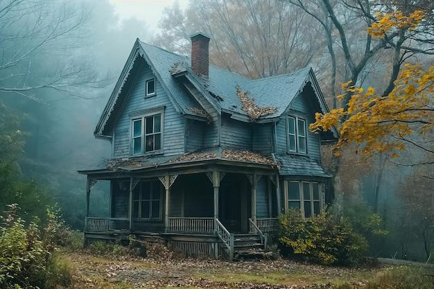
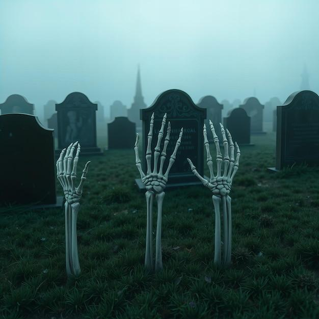
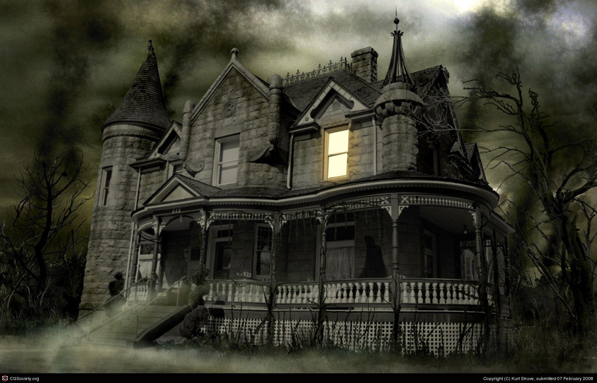

# 🎬 AI Horror Short Generation System

An end-to-end automated pipeline that generates horror short videos using AI, combining scriptwriting, image curation, narration, and video rendering.

![Pipeline Overview]

## 🌟 Features

- **Fully Automated**: Serverless pipeline that runs every 2 days
- **AI-Powered**: Utilizes state-of-the-art LLMs and VLMs
- **High-Quality Output**: Curated images and professional narration
- **Scalable**: Built on serverless architecture
- **Cost-Effective**: Uses Modal for compute optimization

## 🧱 Pipeline Components

### 1. Scene Prompt Generation
- Uses LLM to generate ~160 horror scene descriptions
- Examples: foggy roads, haunted houses, abandoned asylums

### 2. Image Collection & Filtering
- Scrapes DuckDuckGo for ~20 images per prompt
- Uses Vision Language Model (VLM) for scoring:
  - Visual quality assessment
  - Prompt relevance check
  - Horror theme alignment
- Retains only images with relevance score >8
- Stores final assets in Amazon S3

#### Sample Images from Collection:




### 3. Script Generation
- Powered by Gemini 2.0 Flash
- Generates horror stories with 6 scenes
- References available images
- Outputs structured JSON format

### 4. Narration
- Uses custom-deployed Dia 1.6B TTS model
- Hosted on Modal for optimal performance
- Professional-quality voice synthesis

### 5. Video Assembly
- Combines multiple elements:
  - Scene-specific images
  - AI-generated narration
  - Background horror music
- Renders final video using MoviePy
- Stores output in S3

#### Final Output:
[Watch the Generated Horror Short](FinalShorts/combined_shorts.mp4)

## ⚙️ Technical Architecture

### Automation & Scheduling
- AWS Lambda triggers the pipeline
- EventBridge schedules (every 2 days at 9 PM IST)
- Modal handles compute-intensive tasks

### Technologies Used
- **AI Models**:
  - LLMs: Gemini, GPT
  - VLMs: Gemini Vision
  - TTS: Dia 1.6B
- **Infrastructure**:
  - AWS Lambda
  - EventBridge
  - Modal
  - Amazon S3
- **Development**:
  - Python
  - MoviePy
  - DuckDuckGo API
  - Custom scraping scripts

## 🚀 Getting Started

### Prerequisites
- Python 3.12+
- AWS Account with S3 access
- Modal Account
- Access to hosted Dia 1.6B TTS model
- Required API keys for Gemini and other services

### Quick Setup
1. **S3 Setup**:
   - Create an S3 bucket for your project
   - Upload your horror-themed background music
   - Set up appropriate IAM permissions

2. **TTS Integration**:
   - Connect to the hosted Dia 1.6B TTS model
   - Configure the endpoint in your environment variables

3. **Environment Configuration**:
   - Set up AWS credentials
   - Configure Modal deployment
   - Add required API keys

### Installation
```bash
# Clone the repository
git clone [repository-url]

# Create virtual environment
python -m venv .venv
source .venv/bin/activate  # On Windows: .venv\Scripts\activate

# Install dependencies
pip install -r requirements.txt
```

> **Note**: A detailed setup guide with step-by-step instructions will be added soon. For now, the basic requirements are:
> 1. Push your horror-themed images to S3
> 2. Add background music to S3
> 3. Connect to the hosted Dia 1.6B TTS model
> 4. Configure the necessary API keys and credentials


*This project is a demonstration of AI-powered content generation and automation. All generated content is for entertainment purposes only.* 